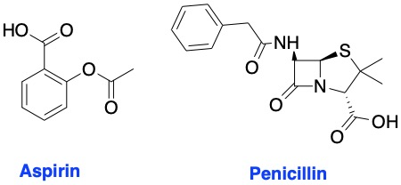

Covalent drugs are drug molecules that attach to their targets by forming a strong chemical bond. Lately, there has been increasing interest in these drugs owing to their potency, sustained target engagement, and efficacy in many clinical indications like cancer. Anticancer drugs like [ibrutinib](https://en.wikipedia.org/wiki/Ibrutinib "ibrutinib"), [afatinb](https://en.wikipedia.org/wiki/Afatinib "afatinib"), [neratinib](https://en.wikipedia.org/wiki/Neratinib "neratinib"), [osimertinib](https://en.wikipedia.org/wiki/Osimertinib), and [dacomitinib](https://en.wikipedia.org/wiki/Dasatinib) are common examples. However, drugs employing this mode of inhibition are not limited to treating only cancer. In fact, [penicillin](https://en.wikipedia.org/wiki/Penicillin "Penicillin") and [aspirin](https://en.wikipedia.org/wiki/Aspirin "aspirin") are classic examples of day-to-day drugs that achieve their effects by covalent inhibition. 

<!-- 
***Aspirin and Penicillin are examples of covalent binding drugs*** -->
 

  

<strong>Aspirin and Penicillin are examples of covalent binding drugs.</strong>

 

In my opinion, covalent binding drugs are the future of modern therapeutics. Despite the historical [concerns about idiosyncratic toxicities and the likelihood of off-target effects](https://blogs.sciencemag.org/pipeline/archives/2017/10/31/watch-your-covalent-drugs-carefully), these drugs are continually gaining traction in regulatory approval by the [U.S. Food and Drug Administration](https://www.fda.gov/) (FDA). To date, there are [over 40 FDA approved covalent drugs](https://www.researchgate.net/figure/List-of-FDA-approved-drugs-that-form-covalent-interactions-with-targets_tbl1_274251591).

One example of this class of drugs is [kinase inhibitors](https://en.wikipedia.org/wiki/Protein_kinase_inhibitor). Kinase inhibitors are drug molecules that inhibit protein kinase enzymes which are implicated in cancer cell proliferation and signalling. In the past few decades, there has been [over 20 approved kinase inhibitors](https://en.wikipedia.org/wiki/Protein_kinase_inhibitor) by the U.S. FDA. As of February 2020, the U.S. FDA has approved [52 small molecule protein kinase inhibitors](https://www.ncbi.nlm.nih.gov/pubmed/31862477). Kinase inhibitor drug discovery as a result has garnered wide attention from research labs and industry. The number of research articles and reviews on the topic has more than doubled in the past decade or so. 

***Some news and literature articles that discuss covalent binding drugs include:***

 - [Covalent Modifiers Blog](http://covalentmodifiers.blogspot.com/)
 - [Covalent Binders in Drug Discovery](https://www.sciencedirect.com/science/article/pii/S007964681830016X)
 - [Covalent Inhibition in Drug Discovery](https://chemistry-europe.onlinelibrary.wiley.com/doi/10.1002/cmdc.201900107)
 - [Covalent Modifiers: An Orthogonal Approach to Drug Design](https://pubs.acs.org/doi/10.1021/jm8008597)
 - [The Resurgence of Covalent Drugs](http://www.nature.com/nrd/journal/v10/n4/full/nrd3410.html)
 - [Advances in Covalent Kinase Inhibitors](https://doi.org/10.1039/C9CS00720B)
 - [Targeted Covalent Inhibitors](https://en.wikipedia.org/wiki/Targeted_covalent_inhibitors)
 - [Covalent Inhibitor Drugs](https://www.chemistryworld.com/feature/covalent-inhibitor-drugs/2500494.article)
 - [Progress with Covalent Small-Molecule Kinase Inhibitors](https://www.sciencedirect.com/science/article/pii/S1359644617304956)
 - [Modeling Covalent-Modifier Drugs](https://www.sciencedirect.com/science/article/abs/pii/S1570963917301097)
 - [Covalent Inhibitors Design and Discovery](https://www.sciencedirect.com/science/article/abs/pii/S0223523417304658)
 - [Emerging and Re-Emerging Warheads for Targeted Covalent Inhibitors](https://pubs.acs.org/doi/10.1021/acs.jmedchem.8b01153)
 - [The Taxonomy of Covalent Inhibitors](https://pubs.acs.org/doi/10.1021/acs.biochem.8b00315)
 - [Privileged Electrophile Sensors: A Resource for Covalent Drug Development](https://www.cell.com/cell-chemical-biology/pdf/S2451-9456(17)30186-1.pdf)
 - [Covalent Drugs form Long Lived Ties](https://pubs.acs.org/cen/coverstory/89/8936cover.html)
 - [Covalent Drugs](http://www.krasavin-group.org/teaching/Lecture_6_-_Covalent_drugs.pdf)
 - [Covalent Small Molecules as Enabling Platforms for Drug Discovery](https://doi.org/10.1002/cbic.201900674)
 - [Covalent Irreversible Enzyme Inhibitors](https://www.ncbi.nlm.nih.gov/pmc/articles/PMC2904065/)
 - [Targeted Covalent Inhibitors for Drug Design](https://www.ncbi.nlm.nih.gov/pubmed/27539547)
 - [Designing Covalent Inhibitors](https://www.degruyter.com/downloadpdf/books/9783110468755/9783110468755-002/9783110468755-002.pdf) 
 - [Covalent Inhibitors in Drug Discovery](http://www.sciencedirect.com/science/article/pii/S135964461500183X)
 - [Drug Discovery for a New Generation of Covalent Drugs](https://www.tandfonline.com/doi/abs/10.1517/17460441.2012.688744?journalCode=iedc20)

This list is not at all comprehensive, but it highlights the wealth of information currently available about this important class of drugs. *I will do my best to add more to the above list if I come across any new content.*
 
