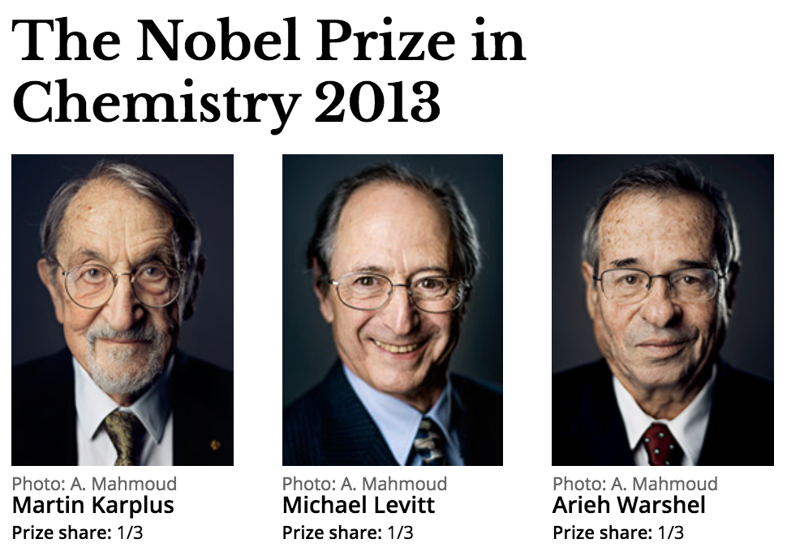

The recent advances in computer technology has revolutionized our core understanding of the structure, bonding, and reactivity of molecular systems, providing novel insights into biological processes occurring in living organisms.(1) Computer simulations ideally bridge the gap between the micro- and macroscopic worlds, and have over the years made tremendous contributions to chemistry, biochemistry, enzymology, and biophysics.(2) 

A myriad of biological processes depend on [enzyme catalysis](https://en.wikipedia.org/wiki/Enzyme_catalysis), whose understanding at the molecular level is of central significance. [Enzymes are extraordinary biomolecules essential to life](https://en.wikipedia.org/wiki/Enzyme), with a catalytic prowess that has inspired almost half a century of scientific research. Despite the advances made in the nature of enzymatic catalysis,(3) a complete understanding of the factors that govern the roots of their rate enhancements and selectivity remains elusive, and are subjects of considerable debate and discussion. Thus, a deeper understanding of their atomistic details and origins is of great practical and fundamental importance((4) in unraveling the mysteries behind their catalytic power. 

[Computer simulations](https://en.wikipedia.org/wiki/Computer_simulation) ideally can play a key role in deciphering the nature of enzymatic reactions. In light of this, the emergence of multiscale models like the combined quantum mechanical/molecular mechanical (QM/MM) method has been a huge advancement in the field. These methods which are increasingly at the forefront of elucidating the mechanisms behind enzyme-catalyzed reactions,(5,6) have led to a more holistic picture of enzymatic catalysis.(4) The [QM/MM](https://en.wikipedia.org/wiki/QM/MM) method in particular, describes a chemical system using different levels of approximation by combining both the accuracy of a [quantum mechanical description](https://en.wikipedia.org/wiki/Quantum_mechanics) with the efficiency of [Newtonian molecular mechanics](https://en.wikipedia.org/wiki/Molecular_mechanics). More generally, the method treats different parts of a complex biological system on different time scales. The method has over the years gained immense popularity and in 2013, its critical contribution to the field of computational chemistry & biochemistry was recognized with a [Nobel Prize](http://www.nobelprize.org/);(7) awarded to [Martin Karplus](https://en.wikipedia.org/wiki/Martin_Karplus), [Michael Levitt](https://en.wikipedia.org/wiki/Michael_Levitt) and [Arieh Warshel](https://en.wikipedia.org/wiki/Arieh_Warshel) for “[the development of multiscale models for complex chemical systems](http://www.nobelprize.org/nobel_prizes/chemistry/laureates/2013/)”. 

In fact, the QM/MM method has been critical to advances in computational enzymology,(8) specifically in the understanding of core principles underlying [enzyme catalysis](https://en.wikipedia.org/wiki/Enzyme_catalysis),(9-12) which undoubtedly stands as one of the greatest challenges in modern-day biochemistry and biophysics. 

----------

**References for Further Reading** 

 1. Merz, K. M. Using Quantum Mechanical Approaches to Study
    Biological Systems. Acc. Chem. Res. **2014**.
 2. Sordo, J. a. Computational Contributions to Chemistry,
    Biological Chemistry and Biophysical Chemistry: The 2013 Nobel Prize in Chemistry. *Anal. Bioanal. Chem*. **2014**, 406, 1825–1828.
 3. Cornish-Bowden, A. Introduction : Enzyme Catalysis and
    Allostery: A Century of Advances in Molecular Understanding. *FEBS J*. **2014**, 281, 433–434.
 4. Gherib, R.; Dokainish, H. M.; Gauld, J. W. Multi-Scale
    Computational Enzymology: Enhancing Our Understanding of Enzymatic Catalysis. *Int. J. Mol. Sci.* **2013**, 15, 401–422.
 5. Warshel, A. Multiscale Modeling of Biological Functions: From
    Enzymes to Molecular Machines (Nobel Lecture). *Angew. Chem. Int. Ed. Engl.* **2014**, 2–14.
 6. Frushicheva, M. P.; Mills, M. J. L.; Schopf, P.; Singh, M. K.;
    Prasad, R. B.; Warshel, A. Computer Aided Enzyme Design and
    Catalytic Concepts. *Curr. Opin. Chem. Biol.* **2014**, 21, 56–62.
 7. Royal, T. H. E.; Academy, S.; Sciences, O. F. Development of
    Multiscale Models for Complex Chemical Systems. **2013**, 50005.
 8. In Silico Enzyme Modelling. 2014, 45, 12–15.
 9. Senn, H. M.; Thiel, W. QM/MM Methods for Biomolecular Systems.
    *Angew. Chemie - Int. Ed*. **2009**, 48, 1198–1229.
 10. Ranaghan, K. E.; Mulholland, A. J. Investigations of
     Enzyme-Catalysed Reactions with Combined Quantum
     Mechanics/molecular Mechanics (QM/MM) Methods. *Int. Rev. Phys.
     Chem.* **2010**, 29, 65–133.
 11. Lonsdale, R.; Harvey, J. N.; Mulholland, A. J. A Practical
     Guide to Modelling Enzyme-Catalysed Reactions. *Chem. Soc. Rev.*
     **2012**, 41, 3025.
 12. Van Der Kamp, M. W.; Mulholland, A. J. Combined Quantum
     Mechanics/molecular Mechanics (QM/MM) Methods in Computational Enzymology. *Biochemistry*, **2013**, 52, 2708–2728.

----------

 
