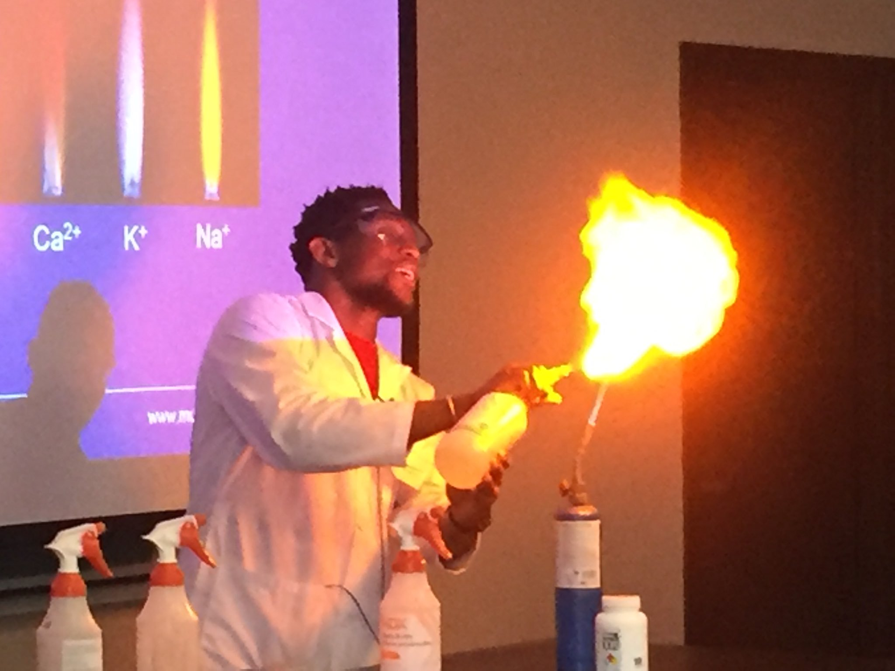

The year 2019 marked the 100th anniversary of the International Union of Pure and Applied Chemistry ([IUPAC](https://iupac.org/)) and also the 150th anniversary of the development of the Periodic Law of Elements independently by [Dmitri Mendeleev](https://en.wikipedia.org/wiki/Dmitri_Mendeleev) and [Lothar Meyer](https://en.wikipedia.org/wiki/Julius_Lothar_Meyer).

In celebration of this anniversary, IUPAC and International Younger Chemists Network ([IYCN](https://www.iycnglobal.com/)) announced the creation of a [Periodic Table of Younger Chemists](https://iupac.org/100/pt-of-chemist/). The winners of each element were revealed according to the [timeline of chemical elements discovery](https://en.wikipedia.org/wiki/Timeline_of_chemical_element_discoveries).

I am honoured to have been [selected to represent Zinc (Zn)](https://iupac.org/100/pt-of-chemist/#ernest-awoonor-williams) in the Periodic Table of Younger Chemists for the celebration of IUPAC@100 and IYPT.

 
**Demonstrating [flame test](https://chem.libretexts.org/Bookshelves/Inorganic_Chemistry/Modules_and_Websites_(Inorganic_Chemistry)/Descriptive_Chemistry/Elements_Organized_by_Block/1_s-Block_Elements/Group__1%3A_The_Alkali_Metals/2Reactions_of_the_Group_1_Elements/Flame_Tests) to the general public during [Science Rendezvous](http://www.sciencerendezvous.ca/) at [MUN](https://www.mun.ca/) in 2017.**

 
